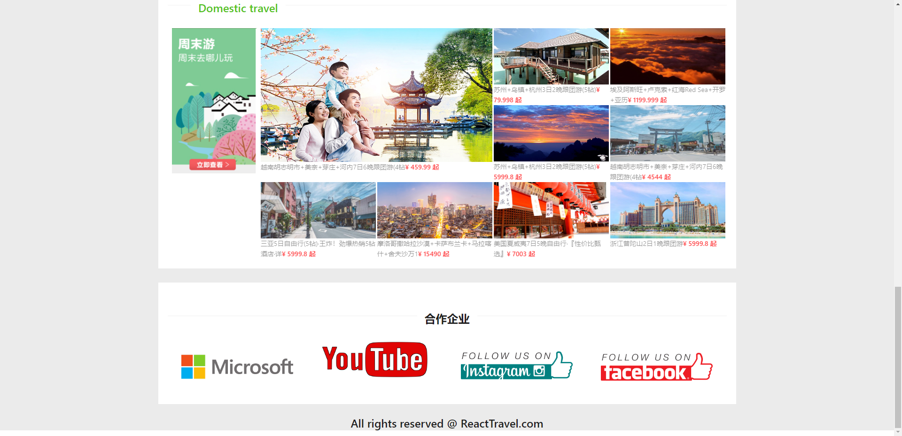
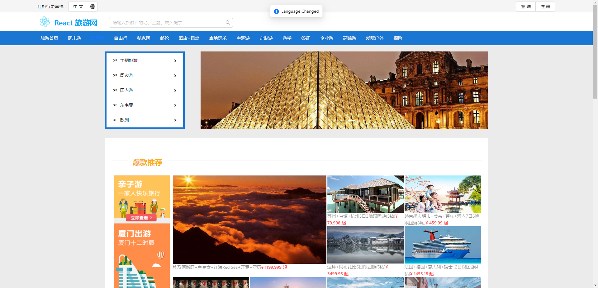
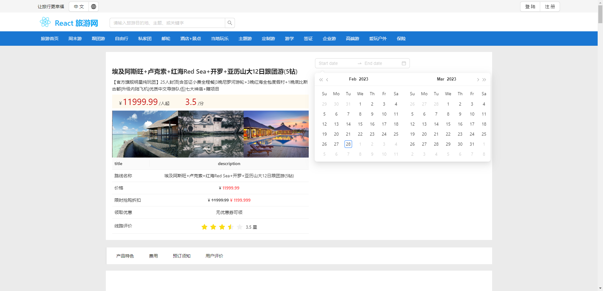
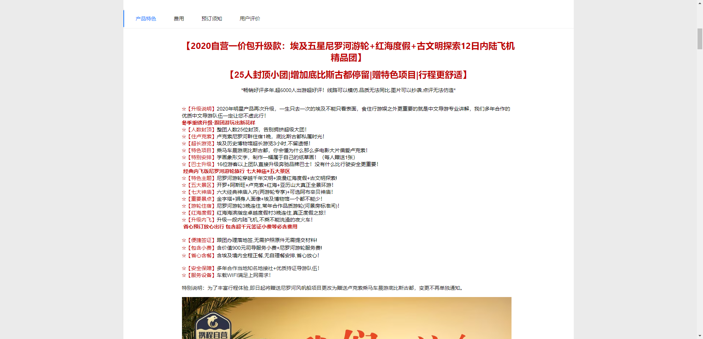
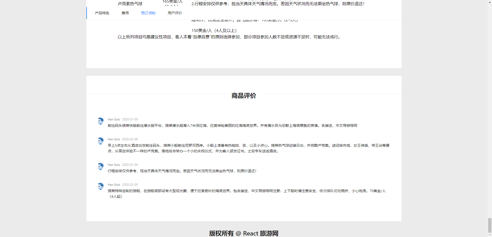
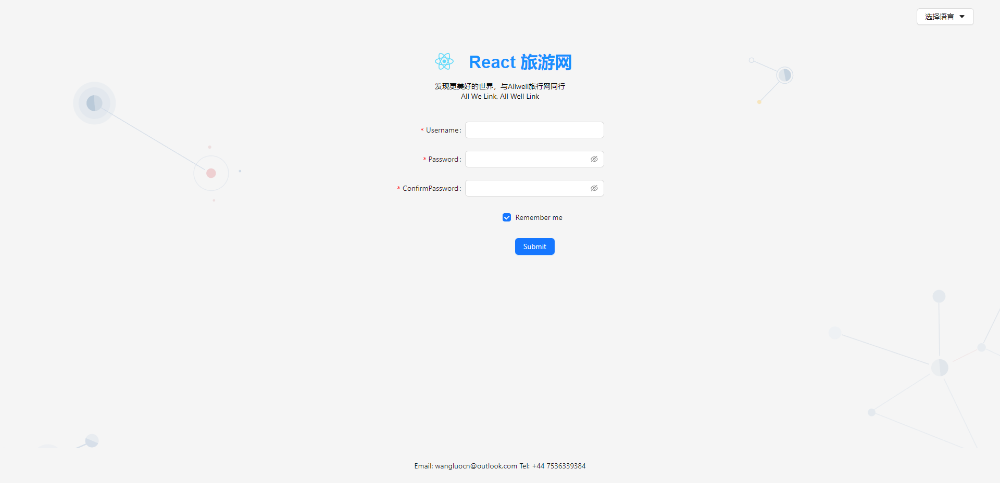
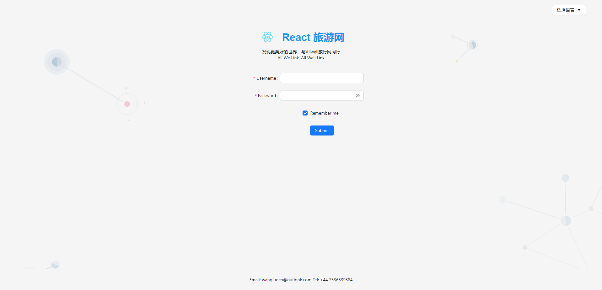

# React Online Travel

The React Travel website is an online travel platform developed by React18. It aims to provide users with travel route planning (domestic and overseas), personalisation of private tours and so on. It also provides various information such as hotel photos, photos of sights, hotel phone numbers, hotel addresses and hotel reviews from real users to facilitate the user's choice.
<br />
<br />
Technologies in this project
<br />
<br />


<br />
<br />

## Table of Contents

- [TodoList](#to-do-list)
- [Dev Environments](#dev-environments)
- [Usage](#usage)
- [Demo](#demo)
- [Related Efforts](#related-efforts)
- [Maintainers](#maintainers)

## TO DO List
- [x] create-react-app Build a TS-based runtime environment
- [x] react-redux implements global management of website state
- [x] react-router handles public and private routes
- [x] Ant design4 implements page componentized architecture
- [x] i18n International processing
- [x] RESTful API to obtain back-end data
- [x] redux-persist for website state persistence
- [x] eject and configure Webpack Containerisation and Docker Deployment and Go Live


## Dev Environments

1. Node18
2. React18 
3. TypeScript 4.9.4
4. Redux 4.2.0
5. Antd 5.2.2
6. i18n 12.2.0

## Usage

Terminal
```sh
$ npm start
# Local Host Port:3000
```

## Demo
<div align="center">
    
    
    
    
    
    
    
    
</div>

<div align="center">Ongoing Updating</div>
<!-- To see how the specification has been applied, see the [example-readmes](example-readmes/). -->

## Related Efforts
Not completed
<!-- - [Art of Readme](https://github.com/noffle/art-of-readme) - 💌 Learn the art of writing quality READMEs.
- [open-source-template](https://github.com/davidbgk/open-source-template/) - A README template to encourage open-source contributions. -->

## Maintainers

[@WwLuo](https://github.com/WwLuo-1024).

<!-- ## Contributing

Feel free to dive in! [Open an issue](https://github.com/RichardLitt/standard-readme/issues/new) or submit PRs.

Standard Readme follows the [Contributor Covenant](http://contributor-covenant.org/version/1/3/0/) Code of Conduct.

### Contributors

This project exists thanks to all the people who contribute. 
<a href="https://github.com/RichardLitt/standard-readme/graphs/contributors"></a> -->


<!-- ## License

[MIT](LICENSE) © Richard Littauer -->
